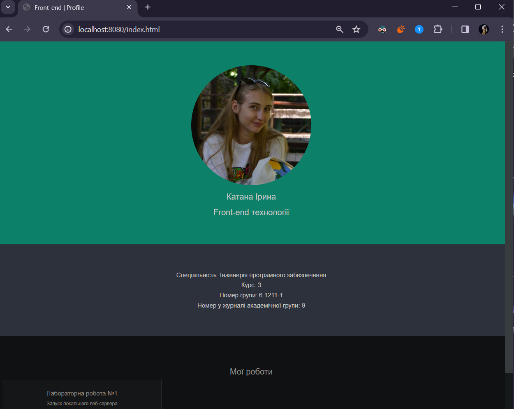

# Лабораторна робота №1: Запуск локального веб-сервера


## Завдання

1. Завантажити шаблон профайлу студента (файл: profile_page_template.html).

2. Заповнити шаблон власними даними (включаючи реальне фото!).

3. Зберігти профайл з імя'м index.html в проекті, структура якого наведена на рис. 1.

4. Запустити веб-сервер для локального тестування HTML сторінки, використовуючи один з існуючих офіційних докер образів та створивши відповідний Dockerfile.

5. Створити власний репозиторій у системі контролю версій (bitbucket.org або github.com)

6. Розмістити файли проекту у директорії lab1 власного репозиторію.

7. У якості звіта з виконання роботи надати посиляння на власний репозиторій у системі контроля версій.

## Звіт

- Використовувався докер-образ httpd
- Для збирання Docker-образу використано команду:

```bash
docker build -t my-web-server .
```

- Для запуску веб-сервера використано команду:

```bash
docker run -d -p 8080:80 my-web-server
```

- Сайт доступний за посиланням http://localhost:8080/index.html.

##

